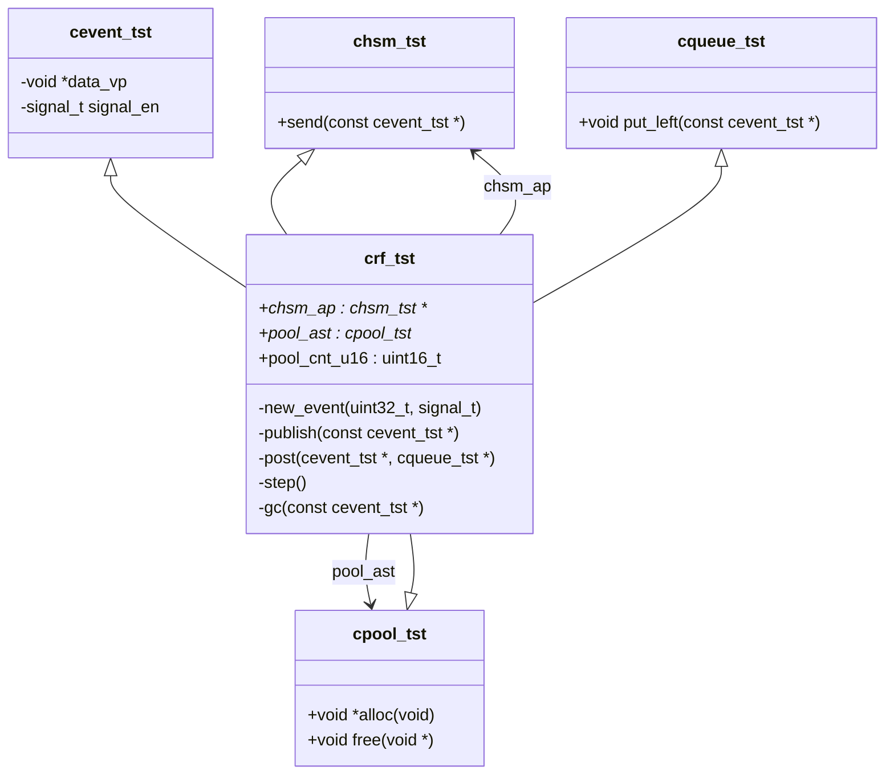

```mermaid
classDiagram
	class chsm_tst {
		+send(const cevent_tst *)
	}

	class cevent_tst {
		-void *data_vp
		-signal_t signal_en
	}

	class cpool_tst {
		+void *alloc(void)
		+void free(void *)
	}

	class cqueue_tst {
		+void put_left(const cevent_tst *)
	}

	class crf_tst {
		-new_event(uint32_t, signal_t)
		-publish(const cevent_tst *)
		-post(cevent_tst *, cqueue_tst *)
		-step()
		-gc(const cevent_tst *)
		+chsm_ap : chsm_tst **
		+pool_ast : cpool_tst *
		+pool_cnt_u16 : uint16_t
	}

	chsm_tst <|-- crf_tst
	cevent_tst <|-- crf_tst
	cpool_tst <|-- crf_tst
	cqueue_tst <|-- crf_tst

	crf_tst --> chsm_tst : chsm_ap
	crf_tst --> cpool_tst : pool_ast

```
